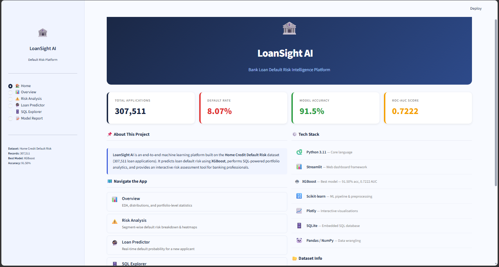
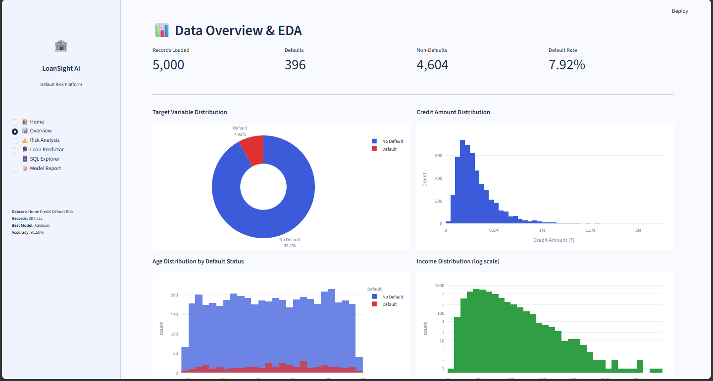
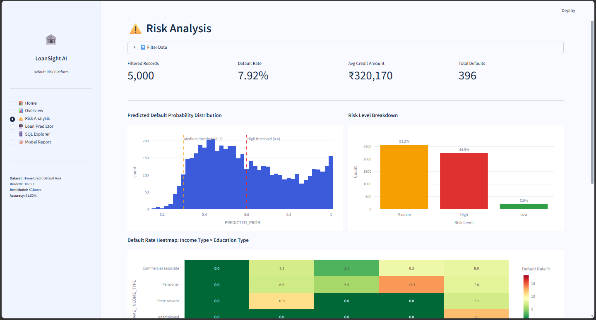
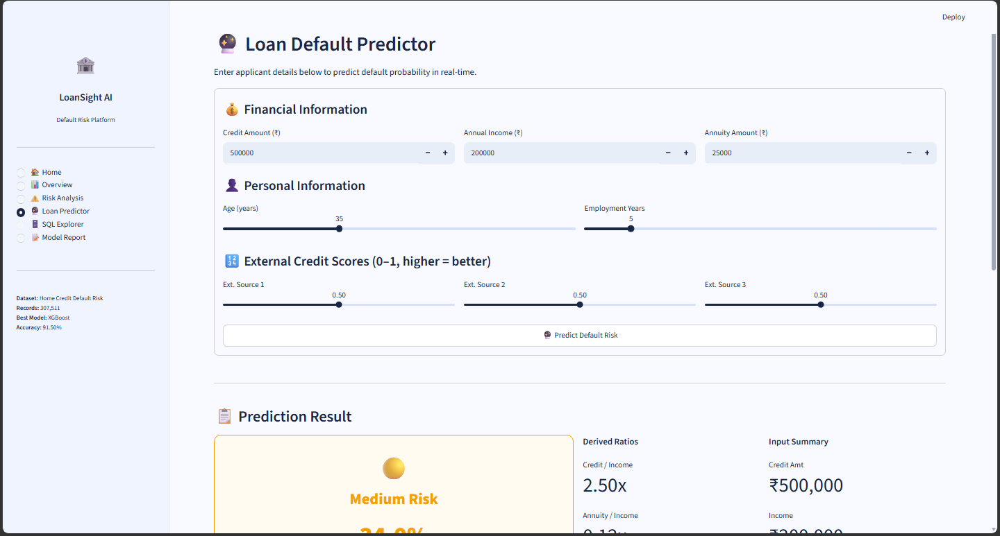
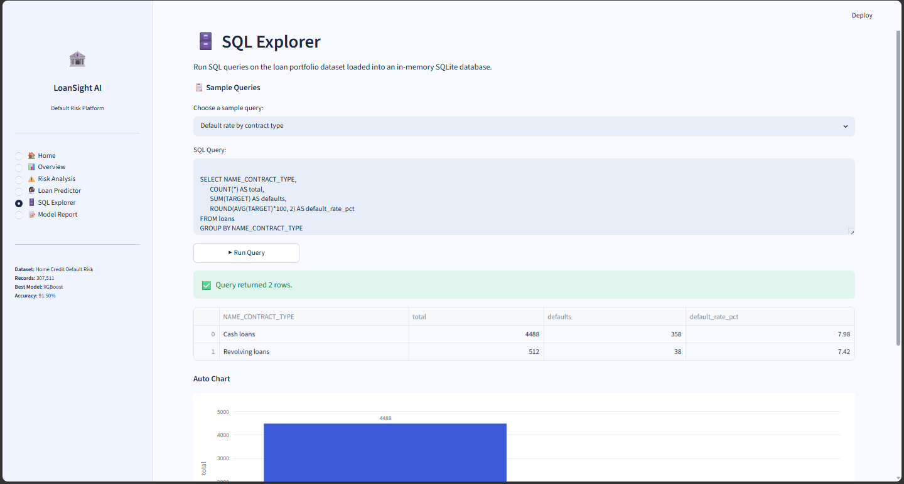
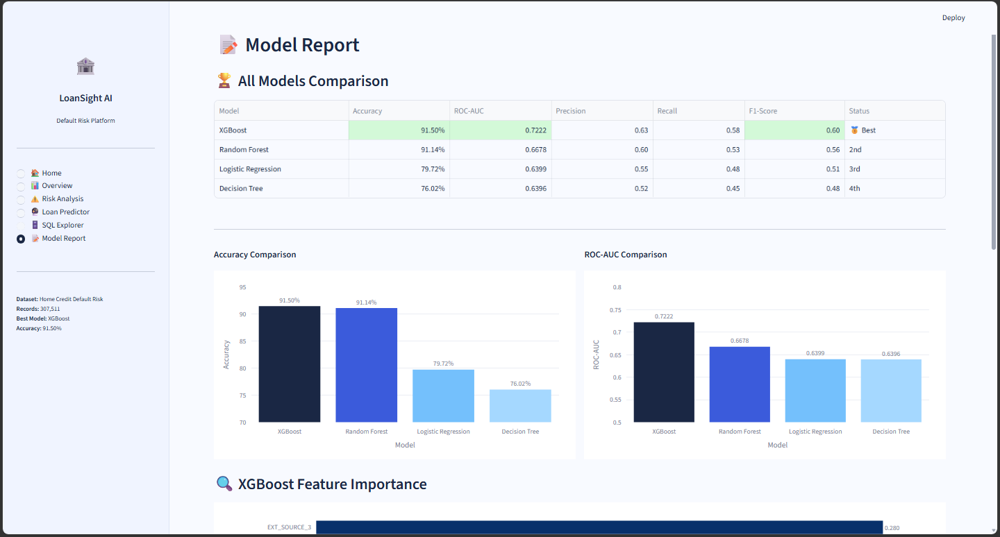

# 🏦 LoanSight AI — Bank Loan Default Risk Intelligence Platform


An end-to-end machine learning platform built on the **Home Credit Default Risk** dataset (307,511 loan applications). LoanSight AI predicts loan default risk using XGBoost, performs SQL-powered portfolio analytics, and provides an interactive risk assessment tool for banking professionals.

---

## 📸 App Screenshots

| Home | Overview |
|------|----------|
|  |  |

| Risk Analysis | Loan Predictor |
|---------------|----------------|
|  |  |

| SQL Explorer | Model Report |
|--------------|--------------|
|  |  |

---

## 🚀 Features

- **🏠 Home** — Project overview, KPI metrics, tech stack, and dataset info
- **📊 Data Overview & EDA** — Target distribution, credit/income/age analysis, default rates by gender, education, and contract type
- **⚠️ Risk Analysis** — Interactive filters, risk level breakdown, default heatmap (income × education), credit-to-income scatter
- **🔮 Loan Default Predictor** — Real-time default probability prediction with gauge chart, risk classification, and recommendation
- **🗄️ SQL Explorer** — Run live SQL queries on the loan portfolio with auto-chart generation
- **📝 Model Report** — Model comparison table, accuracy/ROC-AUC charts, feature importance, radar chart, and hyperparameter details

---

## 📊 Model Performance

| Model | Accuracy | ROC-AUC | Status |
|-------|----------|---------|--------|
| **XGBoost** | **91.50%** | **0.7222** | 🥇 Best |
| Random Forest | 91.14% | 0.6678 | 2nd |
| Logistic Regression | 79.72% | 0.6399 | 3rd |
| Decision Tree | 76.02% | 0.6396 | 4th |

---

## 🗂️ Project Structure

```
BankLoan/
├── app/
│   ├── .streamlit/
│   └── app.py                   # Main Streamlit app (single file)
├── assets/                      # Logo / icons
├── data/
│   ├── processed/
│   │   ├── sample_data.csv      # Processed dataset used by app
│   │   └── engineered_data.csv  # Feature engineered dataset
│   └── raw/                     # Raw Kaggle CSVs (not pushed to GitHub)
├── images/                      # EDA & model plots from notebooks
├── models/
│   ├── best_model.pkl           # Trained XGBoost model
│   ├── feature_names.pkl        # Feature names list
│   └── scaler.pkl               # StandardScaler
├── notebooks/
│   ├── 01_EDA.ipynb
│   ├── 02_Feature_Engineering.ipynb
│   ├── 03_Model_Training.ipynb
│   ├── 04_SQL_Analytics.ipynb
│   └── 05_Model_Evaluation.ipynb
├── screenshots/                 # App screenshots
├── .gitignore
├── README.md
└── requirements.txt
```

---

## ⚙️ Tech Stack

| Category | Tools |
|----------|-------|
| Language | Python 3.12 |
| Dashboard | Streamlit |
| ML Models | XGBoost, Random Forest, Logistic Regression, Decision Tree |
| ML Pipeline | Scikit-learn (Imputer, StandardScaler) |
| Visualisation | Plotly |
| Database | SQLite |
| Data Wrangling | Pandas, NumPy |

---

## 🔢 Dataset

- **Source:** [Home Credit Default Risk — Kaggle](https://www.kaggle.com/c/home-credit-default-risk)
- **Total Records:** 307,511 loan applications
- **Target:** Binary — `1` = Default, `0` = Repaid
- **Class Imbalance:** ~8.07% positive class
- **Features Used:** 10 engineered features (EXT_SOURCE_1/2/3, AMT_CREDIT, AMT_INCOME_TOTAL, AMT_ANNUITY, DAYS_BIRTH, DAYS_EMPLOYED, CREDIT_INCOME_RATIO, ANNUITY_INCOME_RATIO)

---

## 🔍 XGBoost — Top Features

| Feature | Importance |
|---------|-----------|
| EXT_SOURCE_3 | 0.280 |
| EXT_SOURCE_2 | 0.220 |
| EXT_SOURCE_1 | 0.180 |
| CREDIT_INCOME_RATIO | 0.100 |
| AMT_CREDIT | 0.070 |

---

## 🛠️ Installation & Setup

**1. Clone the repository**
```bash
git clone https://github.com/shubhamjais04/BankLoan.git
cd BankLoan
```

**2. Create virtual environment**
```bash
py -3.12 -m venv venv
.\venv\Scripts\activate       # Windows
source venv/bin/activate      # Mac/Linux
```

**3. Install dependencies**
```bash
pip install -r requirements.txt
```

**4. Run the app**
```bash
cd app
streamlit run app/app.py
```

App opens at `http://localhost:8501`

---

## 📦 Requirements

```
streamlit
pandas
numpy
plotly
scikit-learn
xgboost
```

---

## 👤 Author

**Shubham Jaiswal**
- 💼 Data Science & ML Enthusiast
- 🔗 [LinkedIn](https://linkedin.com/in/shubhjais04)
- 🐙 [GitHub](https://github.com/shubhamjais04)

---

## 📄 License

This project is licensed under the MIT License.
